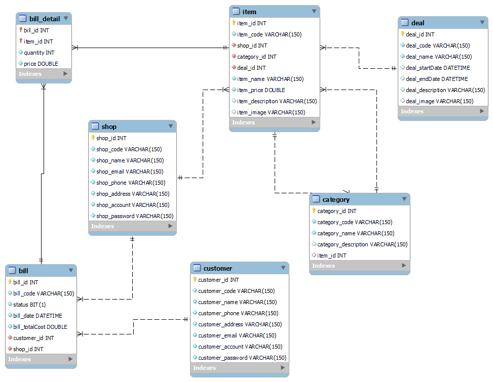

# Ten Ten Food (Shopee Food Fake)
## Ý tưởng: web giúp cộng tác viên bán đồ ăn đến với người dùng, quản lý các gian hàng online.
### Các chức năng chính:
+ Quản lý cộng tác viên (gian hàng)
+ Quản lý sản phẩm (món ăn)
+ Quản lý hóa đơn
+ Quản lý khách hàng
+ Quản lý nhãn món ăn
+ QL hoa dơn chi tiet
  + Quản lý danh mục
  + Đăng ký tài khoản, đổi mk, lấy lại mk khi quên
  có 3 user chính sử dụng web:
  Tất cả đều sử dụng chức năng đăng nhập, đăng ký, đổi mk,quên mk
- Cộng tác viên:
  + QL San pham
  + QL Hóa đơn
  + QL món ăn
- Khách hàng:
  + QL hoa dơn chi tiet
- Admin:
  + QL cộng tác viên
  + QL sản phẩm
  + QL hóa đơn
  + QL khach hang
  + QL mon an
  + QL nhãn món ăn
  + QL danh mục
### Thiết kế database 
+ Chuẩn hóa và thiết kế mức khái niệm:
    + Quản lý cộng tác viên (gian hàng) CTV (id,maCTV,tenCTV,email,password,tenNhaHang, soDienThoai, diaChi)
    + Quản lý sản phẩm (món ăn) SP (id, maSP,tenSP, img, ghiChu, giaTien, id_CTV,id_loaiSP,id_danhMuc)
    + Quản lý khách hàng KH(id, maKH, tenKH, soDienThoai, email, diaChi)
    + Quản lý hóa đơn HD(id, maHD, ngayMuaSP, ngayTaoHoaDon, ngayShipHang, status, id_KH, id_CTV)
    + Quản lý loai SP loaiSP(id, maLoaiSP, tenLoaiSP,moTa)
    + QL hoa dơn chi tiet HDChiTiet(id_HD,id_SP, soLuongDH)
    + Quản lý danh mục DanhMuc(id,maDanhMuc,tenDanhMuc,img, soLuongDiaDiem)
    + Đăng ký tài khoản, đổi mk, lấy lại mk khi quên
+ Bỏ qua mức logic đi thẳng tới vật lý do thời gian có hạn

    + 

+ Code :
    + Công nghệ sử dụng: 
      + Java jdk 8
      + IDE Intellij 2022.1.3
      + MySQL workbench 8.0
      + Bootstrap 3
      + Git
      + Google Chorm
    + Kỹ năng áp dụng:
      + Mô hình MVC 
      + DI (Dependency Inverse) Đọc để rõ hơn tại link: https://toidicodedao.com/2015/03/24/solid-la-gi-ap-dung-cac-nguyen-ly-solid-de-tro-thanh-lap-trinh-vien-code-cung/
      + JDBC Connector mySQL gradle, querying and transaction
      + Sử dụng webservlet, jsp, jstl, css, js ...
      + Bootstrap make fronend
      + Cộng tác git 
      + Chuẩn hóa database và xây dựng linh hoạt
      + Copy paste và search đỉnh cao :V 